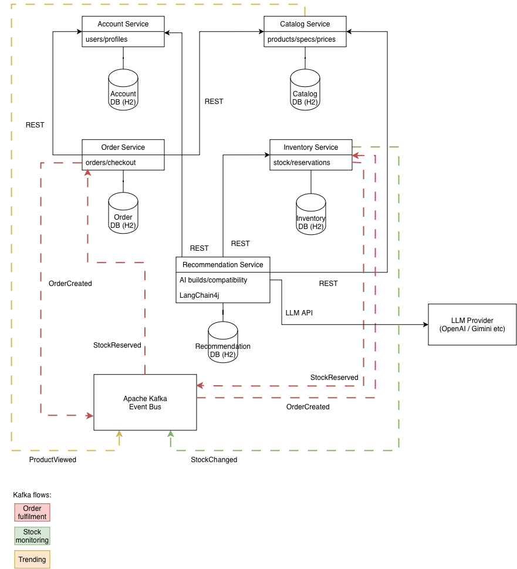

# Architecture

> Source: `source-docs/architecture.drawio.png`

## Diagram Summary

The diagram shows five microservices, each with its own H2 database, communicating synchronously over REST and asynchronously through an Apache Kafka event bus.

### Services

| Service | Responsibilities (as labelled) | Database |
|---|---|---|
| Account Service | users/profiles | Account DB (H2) |
| Catalog Service | products/specs/prices | Catalog DB (H2) |
| Order Service | orders/checkout | Order DB (H2) |
| Inventory Service | stock/reservations | Inventory DB (H2) |
| Recommendation Service | AI builds/compatibility, LangChain4j | Recommendation DB (H2) |

Ports and base path for each service are listed in [api-endpoints.md](api-endpoints.md#service-port-mapping-and-base-path).

### Synchronous REST Calls

| From | To |
|---|---|
| Order Service | Account Service |
| Order Service | Catalog Service |
| Order Service | Recommendation Service |
| Catalog Service | Inventory Service |
| Recommendation Service | Account Service |
| Recommendation Service | Catalog Service |
| Recommendation Service | Inventory Service |

The architecture diagram does not show the Order Service → Recommendation Service call (R3, decision 7) or the Catalog Service → Inventory Service call (C2 stock status, decision 8).

### External Integration

| From | To | Via |
|---|---|---|
| Recommendation Service | LLM Provider (OpenAI / Gemini etc) | LLM API |

### Kafka Flows

| Flow | Event | Publisher → Consumer |
|---|---|---|
| Order fulfilment | OrderPlaced | Order Service → Apache Kafka Event Bus → Inventory Service (published on checkout, DRAFT → PLACED) |
| Order fulfilment | StockReserved | Inventory Service → Apache Kafka Event Bus → Order Service |
| Order fulfilment | StockReservationFailed | Inventory Service → Apache Kafka Event Bus → Order Service |
| Order fulfilment | OrderCancelled | Order Service → Apache Kafka Event Bus → Inventory Service |
| Order fulfilment | OrderCompleted | Order Service → Apache Kafka Event Bus → Inventory Service |
| Stock monitoring | StockChanged | Inventory Service → Apache Kafka Event Bus |
| Trending | ProductViewed | Catalog Service → Apache Kafka Event Bus → Catalog Service (trending list, decision 9) |

The architecture diagram labels the checkout event `OrderCreated`; the event name used in the specs is `OrderPlaced` (see decision 3). `StockReservationFailed`, `OrderCancelled` and `OrderCompleted` are not shown in the diagram (see decisions 4 and 6).

`StockChanged` is an integration/umbrella event representing inventory stock changes; it may be derived from the inventory events `StockLevelUpdated`, `StockLow` or `ProductRestocked` (see [event-sourcing.md](event-sourcing.md#33-event-types)).

## Architecture Decisions

| # | Topic | Status | Decision |
|---|---|---|---|
| 1 | Cart | Resolved | No separate Cart aggregate, entity or microservice. The Order aggregate also represents the shopping cart before checkout: a `DRAFT` order is the customer's cart, products can be added/removed while the order is `DRAFT`, and checkout transitions it to `PLACED`, after which the normal order / inventory / Kafka flow begins. Lifecycle: `DRAFT -> PLACED -> PROCESSING -> COMPLETED / CANCELLED` (see [Order Lifecycle](domain-model.md#33-order-lifecycle)). |
| 2 | Stock reservation timing | Resolved | Stock is reserved after checkout (order `PLACED`), when Inventory Service consumes `OrderPlaced` from Kafka. The FR-06 / I1 time limit applies to payment: if payment is not recorded within the time limit, the order is `CANCELLED` and the reservation is released via `OrderCancelled`. |
| 3 | Checkout event name | Resolved | The Kafka event published on checkout is `OrderPlaced` (matches DRAFT → PLACED); it replaces `OrderCreated`. `CheckoutStarted` (listed in the User Stories document for O1) is not used, because checkout is a single DRAFT → PLACED transition. |
| 4 | Order ↔ Inventory event flow | Resolved | `OrderPlaced` → reserve stock → `StockReserved` (order → PROCESSING) or `StockReservationFailed` (order → CANCELLED). `OrderCancelled` → release reservation. Payment success → COMPLETED → `OrderCompleted` → confirm reservation (decision 6). |
| 5 | Inventory reservation REST endpoints | Resolved | In the normal order flow, stock is reserved and released through Kafka events, not REST. The I1 REST endpoints (`POST`/`DELETE /inventory/{productId}/reservations`) are kept for direct use and testing. |
| 6 | Stock reservation confirmation | Resolved | When payment is recorded as PAID (order → COMPLETED), Order Service publishes `OrderCompleted`. Inventory Service consumes it and issues `ConfirmStockReservationCommand`, which records `StockReservationConfirmed`: the reservation becomes `CONFIRMED` and the reserved quantity is deducted from stock. |
| 7 | Order from a recommended build (R3) | Resolved | The endpoint is `POST /orders/from-recommendation/{recommendationId}`. Order Service calls Recommendation Service over REST (`GET /recommendations/{recommendationId}`) to get the build components, then creates a DRAFT order with them. |
| 8 | Product stock status (C2) | Resolved | Catalog Service calls Inventory Service over REST (`GET /inventory/{productId}`) to show current stock status in product details (FR-02). |
| 9 | Catalog events | Resolved | `ProductViewed` is the only Catalog event published to Kafka: it is published when product details are viewed (C2) and consumed by Catalog Service itself to maintain the trending list (C3, FR-03). `ProductCreated`, `ProductUpdated`, `ProductRemoved` and `ProductReviewed` are domain events internal to Catalog Service and are not published to Kafka. Payloads are listed in [Catalog Domain Events](domain-model.md#15-catalog-domain-events). |
| 10 | Product category and listing categories | Resolved | `Product` holds a required `categoryId` (Product 0..\* — 1 Category). `GET /categories` is added under C1 so that customers can browse products by category. |
| 11 | Admin authorisation | Open | C5, I3 and NFR-04 require administrative endpoints to be restricted to authorised administrators, but no mechanism is defined yet (no role on `User`, no token format for `AuthenticationResponse`). Deferred until Account Service is implemented; to be decided project-wide together with Account Service authentication (A2). Until then the Catalog Service C5 endpoints are not protected. |
