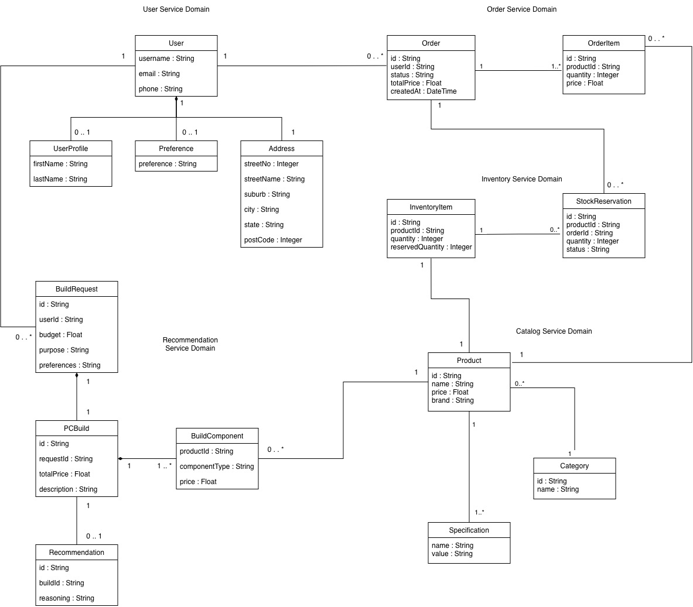
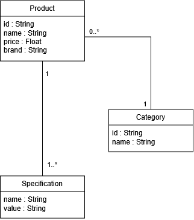
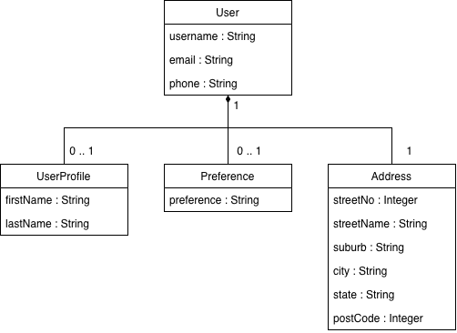
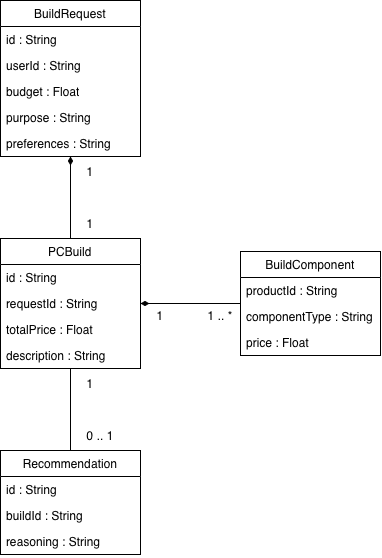

# Domain Model

> Source: `source-docs/Domain Model-3.docx`



*Overview diagram: class diagram of all five service domains (Account, Order, Inventory, Catalog, Recommendation) with the fields listed below and the associations between them — e.g. User 1 — 0..1 UserProfile / 0..1 Preference / 0..\* Address, User 1 — 0..\* Order, Order 1 — 1..\* OrderItem, OrderItem 0..\* — 1 Product, Order 1 — 0..\* StockReservation, InventoryItem 1 — 0..\* StockReservation, InventoryItem 1 — 1 Product, Product 0..\* — 1 Category, Product 1 — 1..\* Specification, User 1 — 0..\* BuildRequest, BuildRequest 1 — 1 PCBuild, PCBuild 1 — 1..\* BuildComponent, BuildComponent 0..\* — 1 Product, PCBuild 1 — 0..1 Recommendation. The diagram's "User Service Domain" label refers to the Account Service.*

> The diagrams show User 1 — 1 Address; the relationship used in the specs is User 1 — 0..\* Address (a user can have several saved delivery addresses, A1). The diagrams also predate these additions, which are defined only in the tables below: `Review` (1.4), `StockNotificationSubscription` (2.3), `Order.deliveryAddressId` and `Order.paymentStatus` (3.1), `User.id` and `User.passwordHash` (4.1), `Address.id` (4.4) and `BuildComponent.id` (5.3).

## Domain Classes and Link to Requirements

| Service | Related Requirements | Domain Classes |
|---|---|---|
| Catalog Service | FR-01, FR-02, FR-03, FR-04, FR-05 | Product, Category, Specification, Review |
| Inventory Service | FR-02, FR-06, FR-07, FR-08, FR-11 | InventoryItem, StockReservation, StockNotificationSubscription |
| Order Service | FR-06, FR-09, FR-10, FR-11, FR-12, FR-13, FR-14, FR-20 | Order, OrderItem |
| Account Service | FR-10, FR-13, FR-15, FR-16, FR-17 | User, UserProfile, Preference, Address |
| Recommendation Service | FR-17, FR-18, FR-19, FR-20, FR-21 | BuildRequest, PCBuild, BuildComponent, Recommendation |

| Domain Class | Description | Type |
|---|---|---|
| Product | PC product or component available in the product catalog | Aggregate Root / Entity |
| Category | Product category used to organise related PC components | Aggregate Root / Entity |
| Specification | Technical attributes and specifications of a product | Value Object |
| Review | Customer review and rating of a product | Aggregate Root / Entity |
| InventoryItem | Stock record for a product; maintains quantity and availability | Aggregate Root / Entity |
| StockReservation | Temporary stock allocation created during checkout | Entity |
| StockNotificationSubscription | Customer registration to receive stock notifications for a product (CRUD, not part of the event-sourced InventoryItem) | Aggregate Root / Entity |
| Order | Customer purchase; manages the order lifecycle and fulfilment status. A DRAFT order acts as the customer's cart | Aggregate Root / Entity |
| OrderItem | Individual product and quantity included in an order | Entity |
| User | Registered customer account and authentication information | Aggregate Root / Entity |
| UserProfile | Personal profile details associated with a user | Value Object |
| Preference | Saved customer preferences used for PC build recommendations | Value Object |
| Address | Saved customer delivery address | Entity |
| BuildRequest | Customer request containing budget, intended use, and preferences for a PC build | Aggregate Root / Entity |
| PCBuild | Complete PC configuration consisting of selected components | Aggregate Root / Entity |
| BuildComponent | Individual PC component included in a build | Entity |
| Recommendation | Generated PC build recommendation associated with a customer request | Entity |

## 1. Catalog Service Domain Model

### 1.1 Product

| Field Name | Type | Description | Constraints |
|---|---|---|---|
| id | String | Unique Identifier of each product | Primary Identifier |
| name | String | Product Name | Required |
| price | Float | Price of the item | Required |
| brand | String | Brand the item belongs to | Required |

### 1.2 Category

| Field Name | Type | Description | Constraints |
|---|---|---|---|
| id | String | Unique identifier of the category of item | Primary Identifier |
| name | String | Name of category item belongs to | Required |

### 1.3 Specification

| Field Name | Type | Description | Constraints |
|---|---|---|---|
| name | String | Name of the specification | Required |
| value | String | Specification Value | Required |

### 1.4 Review

| Field Name | Type | Description | Constraints |
|---|---|---|---|
| id | String | Unique identifier of each review | Primary Identifier |
| productId | String | Identifier of the reviewed product | Required |
| userId | String | Identifier of the user who submitted the review | Required |
| rating | Integer | Rating given to the product | Required |
| comment | String | Review text | Optional |
| createdAt | DateTime | Date and Time the review was submitted | Required |



## 2. Inventory Service Domain Model

### 2.1 InventoryItem

| Field Name | Type | Description | Constraints |
|---|---|---|---|
| id | String | Unique identifier of each item | Primary Identifier |
| productId | String | Identifier of the product in the Catalog Service | Required |
| quantity | Integer | Total quantity of the product currently in stock | Required |
| reservedQuantity | Integer | Quantity currently reserved for orders | Required |

### 2.2 StockReservation

| Field Name | Type | Description | Constraints |
|---|---|---|---|
| id | String | Unique identifier of each reservation | Primary Identifier |
| productId | String | Identifier of the product being reserved | Required |
| orderId | String | Identifier of the order the stock is reserved for | Required |
| quantity | Integer | Quantity of the product reserved for the order | Required |
| status | String | Current status of the reservation (ACTIVE/RELEASED/CONFIRMED): ACTIVE after `StockReserved`, RELEASED after `StockReservationReleased`, CONFIRMED after `StockReservationConfirmed` | Required |

### 2.3 StockNotificationSubscription

| Field Name | Type | Description | Constraints |
|---|---|---|---|
| id | String | Unique identifier of each subscription | Primary Identifier |
| productId | String | Identifier of the product to receive notifications for | Required |
| userId | String | Identifier of the user to notify | Required |
| createdAt | DateTime | Date and Time of the subscription | Required |


## 3. Order Service Domain Model

### 3.1 Order

| Field Name | Type | Description | Constraints |
|---|---|---|---|
| id | String | Unique identifier of each order | Primary Identifier |
| userId | String | User ID of the account the order was placed by | Required |
| status | String | Status of the order (DRAFT/PLACED/PROCESSING/COMPLETED/CANCELLED) — see 3.3 | Required |
| totalPrice | Float | Total price of all order items | Required |
| createdAt | DateTime | Date and Time of the order | Required |
| deliveryAddressId | String | Identifier of the saved Address (Account Service) selected for delivery (O2) | Optional |
| paymentStatus | String | Status of the payment (PENDING/PAID/FAILED) (O4) | Required |

### 3.2 OrderItem

| Field Name | Type | Description | Constraints |
|---|---|---|---|
| id | String | Unique identifier of order item | Primary Identifier |
| productId | String | Unique identifier of product | Required |
| quantity | Integer | Number of order items | Required |
| unitPrice | Float | Price of each order item | Required |

### 3.3 Order Lifecycle

There is no separate Cart entity or service: the Order aggregate also represents the shopping cart before checkout.

```text
DRAFT -> PLACED -> PROCESSING -> COMPLETED
  |        |           |
  +--------+-----------+------> CANCELLED
```

| Status | Meaning |
|---|---|
| DRAFT | The customer's cart. OrderItems can be added and removed only in this status. |
| PLACED | Checkout completed (DRAFT → PLACED). The order / inventory / Kafka flow begins (`OrderPlaced` is published). |
| PROCESSING | Stock has been reserved for the order (`StockReserved` received); waiting for payment. |
| COMPLETED | Payment recorded successfully; the order has been fulfilled. |
| CANCELLED | The order was cancelled before it was fulfilled (FR-14). |

**Transitions**

| From | To | Trigger | Kafka event published |
|---|---|---|---|
| — | DRAFT | `POST /orders` or `POST /orders/from-recommendation/{recommendationId}` | — |
| DRAFT | PLACED | Checkout: `POST /orders/{orderId}/checkout` | `OrderPlaced` |
| PLACED | PROCESSING | `StockReserved` received from Inventory Service | — |
| PLACED | CANCELLED | `StockReservationFailed` received from Inventory Service | — |
| PROCESSING | COMPLETED | Successful payment recorded (`paymentStatus` = PAID): `PUT /orders/{orderId}/payment` | `OrderCompleted` |
| PROCESSING | CANCELLED | Failed payment recorded (`paymentStatus` = FAILED), or no payment recorded within the reservation time limit | `OrderCancelled` |
| DRAFT, PLACED, PROCESSING | CANCELLED | Customer cancels: `POST /orders/{orderId}/cancel` (FR-14) | `OrderCancelled` (from PLACED or PROCESSING only) |

- Stock is reserved after checkout, when Inventory Service consumes `OrderPlaced` (I1, O3). The reservation is temporary: if payment is not recorded within the time limit, Order Service cancels the order and publishes `OrderCancelled`, and Inventory Service releases the reservation (FR-06).
- When Inventory Service consumes `OrderCancelled`, it releases any stock reservation held for that order (`StockReservationReleased`).
- When Inventory Service consumes `OrderCompleted`, it confirms the stock reservation for that order (`StockReservationConfirmed`).
- A COMPLETED order cannot be cancelled.

Operations that are not valid for the current status are rejected with `OrderStateViolation` (409 Conflict).


> Note: the diagrams label the OrderItem price field as `price`; the field name used across the specs is `unitPrice`, as in the table above. The diagrams do not show the order status values.

## 4. Account Service Domain Model

### 4.1 User

| Field Name | Type | Description | Constraints |
|---|---|---|---|
| id | String | Unique identifier of each user | Primary Identifier |
| username | String | Unique username of the user | Required |
| email | String | Email of user | Required |
| phone | String | Phone number of the user | Required |
| passwordHash | String | Hashed password used for authentication (A2); the plain password is never stored | Required |

### 4.2 UserProfile

| Field Name | Type | Description | Constraints |
|---|---|---|---|
| firstName | String | First name of the user | Optional |
| lastName | String | Last name of the user | Optional |

### 4.3 Preference

| Field Name | Type | Description | Constraints |
|---|---|---|---|
| preference | String | User preferences for the recommendation service | Optional |

### 4.4 Address

| Field Name | Type | Description | Constraints |
|---|---|---|---|
| id | String | Unique identifier of each address | Primary Identifier |
| streetNo | Integer | Street number of the user’s address | Required |
| streetName | String | Street name of the user’s address | Required |
| suburb | String | Suburb of the user’s address | Required |
| city | String | City of the user’s address | Required |
| state | String | State of the user’s address | Required |
| postCode | Integer | Post code of the user’s address | Required |



> Note: the diagrams do not yet show `User.id`, `User.passwordHash` or `Address.id`; `User.id` is the primary identifier referenced as `userId` by Order, BuildRequest and the `/users/{userId}` endpoints.

## 5. Recommendation Service Domain Model

### 5.1 BuildRequest

| Field Name | Type | Description | Constraints |
|---|---|---|---|
| id | String | Unique identifier of each build request | Primary Identifier |
| userId | String | Identifier of the user requesting the PC build | Required |
| budget | Float | Maximum budget for the requested PC build | Required |
| purpose | String | Intended use of the PC, such as gaming, work, or content creation | Required |
| preferences | String | Additional user preferences for the PC build | Optional |

### 5.2 PCBuild

| Field Name | Type | Description | Constraints |
|---|---|---|---|
| id | String | Unique identifier of each PC build | Primary Identifier |
| requestId | String | Identifier of the build request used to generate this build | Required |
| totalPrice | Float | Total price of all components in the PC build | Required |
| description | String | AI-generated summary of the PC build | Required |

### 5.3 BuildComponent

| Field Name | Type | Description | Constraints |
|---|---|---|---|
| id | String | Unique identifier of each build component | Primary Identifier |
| productId | String | Identifier of the product selected for the PC build | Required |
| componentType | String | Type of PC component, such as CPU, GPU, RAM or motherboard | Required |
| price | Float | Price of the component when the build was generated | Required |

### 5.4 Recommendation

| Field Name | Type | Description | Constraints |
|---|---|---|---|
| id | String | Unique identifier of each recommendation | Primary Identifier |
| buildId | String | Identifier of the PC build associated with the recommendation | Required |
| reasoning | String | AI-generated explanation of why the selected PC build is suitable for the user's requirements | Required |


